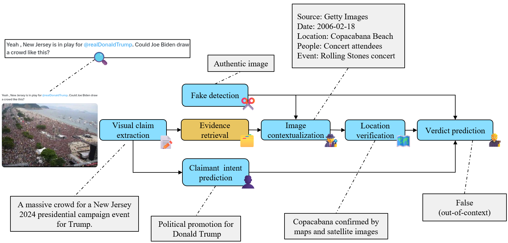

# M4FC: a a Multimodal, Multilingual, Multicultural, Multitask real-world Fact-Checking Dataset

[](https://opensource.org/licenses/Apache-2.0)
[](https://www.python.org/)

This repository contains the M4FC dataset, introduced in the 2025 preprint: ["M4FC: a a Multimodal, Multilingual, Multicultural, Multitask real-world Fact-Checking Dataset](https://www.arxiv.org/abs/2510.23508). The code is released under an **Apache 2.0** license, while the dataset is released under a **CC-BY-SA-4.0** license.

Contact person: [Jiahui Geng](jiahui.geng@mbzuai.ac.ae), [Jonathan Tonglet](mailto:jonathan.tonglet@tu-darmstadt.de) 

[UKP Lab](https://www.ukp.tu-darmstadt.de/) | [TU Darmstadt](https://www.tu-darmstadt.de/)

Don't hesitate to send us an e-mail or report an issue, if something is broken (and it shouldn't be) or if you have further questions. 

## Abstract 
> Existing real-world datasets for multimodal automated fact-checking have multiple limitations: they contain few instances, focus on only one or two languages and tasks, suffer from evidence leakage, or depend on external sets of news articles for sourcing true claims. To address these shortcomings, we introduce M4FC, a new real-world dataset comprising 4,982 images paired with 6,980 claims. The images, verified by professional fact-checkers from 22 organizations, represent diverse cultural and geographic contexts. Each claim is available in one or two out of ten languages. M4FC spans six multimodal fact-checking tasks: visual claim extraction, claimant intent prediction, fake detection, image contextualization, location verification, and verdict prediction. We provide baseline results for all tasks and experiment with various multimodal AFC pipelines to analyze how intermediate tasks influence downstream verdict prediction performance.

<p align="center">
  
</p>


## M4FC dataset

M4FC is a real-world multimodal fact-checking dataset containing 4,982 images paired with 6,980 claims. The annotations are contained in *data/M4FC.json*. 

The images can be download as follows:

```
$ conda create --name M4FC python=3.9
$ conda activate M4FC
$ pip install -r requirements.txt
$ python src/download_m4fc_images.py
```

More information about the dataset can be found in the [README](https://github.com/UKPLab/M4FC/tree/main/data) of the data folder.


### ❕**Content warning** ❕
> M4FC contains examples of real-world misinformation.  Due to the real-world nature of the data, events covered include wars and conflicts. As a result, some images contain graphic, violent content. When collecting the data, we decided not to filter out images with violent content to cover the actual distribution of images that our target users, professional fact-checkers, would want to provide as input. Given the graphic nature of some images, we do not release them directly. Instead, we do publicly release the URLs of the FC articles and the images.

## Environment

Follow these instructions to recreate the environment used for all our experiments.

```
$ conda create --name M4FC python=3.9
$ conda activate M4FC
$ pip install -r requirements.txt
```

## Download evidence

### Reverse image search evidence

We provide the URLs of the reverse image search evidence. The corresponding articles can be scraped using the following script.
```
$ python src/collect_RIS_evidence.py
```

### Satellite and map evidence 🛰️🗺️

Map and satellite images can be downloaded from OpenStreetMap and ESRI World Imagery with the staticmap package. Downloading satellite images requires an ESRI API key.

```
$ python src/download_osm_satellite.py  --api_key  YOUR_API_KEY
```

## Load the dataset for a specific task

Different subsets of the data are used for each of the six tasks. To prepare the dataset for a specific task, use the function *dataset_loader* in the *utils.py* file.


## Citation

If you use the M4FC dataset or this code in your work, please cite our paper as follows:

```bibtex 
@article{geng2025m4fc,
  title={M4FC: a Multimodal, Multilingual, Multicultura, Multitask real-world Fact-Checking Dataset},
  author={Geng, Jihaui and Tonglet, Jonathan and Gurevych, Iryna},
  journal={arXiv preprint arXiv:2510.23508},
  year={2025},
  url={https://arxiv.org/abs/2510.23508},
  doi={10.48550/arXiv.2510.23508}
}
```

## Disclaimer

> This repository contains experimental software and is published for the sole purpose of giving additional background details on the respective publication.
